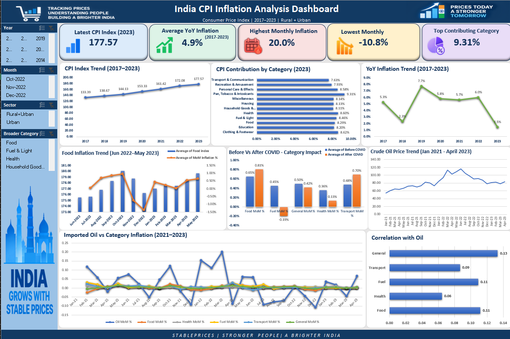

# India CPI Inflation Analysis – Excel Case Study

## 📊 Project Overview

This project analyzes India's Consumer Price Index (CPI) data using Microsoft Excel to understand inflation trends, category-wise changes, year-over-year (YoY) inflation, contribution patterns, and relationships between CPI categories.

The project was completed as part of a Data Analytics case study using a real-world CPI dataset.

## 🎯 Objectives

- Analyze CPI inflation trends over time
- Compare category-wise inflation patterns
- Perform Year-over-Year (YoY) analysis
- Identify categories contributing to inflation
- Analyze relationships between CPI categories using correlation analysis
- Build an interactive Excel dashboard for data-driven insights

## 🛠️ Tools & Techniques

- Microsoft Excel
- Power Query
- Pivot Tables
- Data Cleaning & Transformation
- Excel Formulas
- Correlation Analysis
- Data Visualization
- Interactive Dashboard

## 📁 Project Files

| File | Description |
|------|-------------|
| `All_India_Index_Upto_April23 (Akash).xlsx` | Complete Excel analysis workbook containing raw data, cleaned data, analysis sheets, and interactive dashboard |
| `India_CPI_Inflation_Analysis_Presentation.pptx` | Project presentation containing key insights and recommendations |
| `India CPI Inflation Case Study Problem Statement.pdf` | Original case study problem statement and analysis requirements |

## 📑 Excel Workbook Structure

The Excel workbook contains separate sheets for:

- Raw Data
- Cleaned Data
- CPI analysis and calculations
- Category-wise analysis
- YoY trend analysis
- Contribution analysis
- Correlation analysis
- Interactive Dashboard

## 📈 Dashboard

The interactive dashboard provides a visual summary of CPI trends and category-level inflation analysis.

It includes:

- CPI trend analysis
- Inflation trend visualization
- Category contribution analysis
- YoY analysis
- Key performance indicators
- Interactive filtering and visualization

## 💡 Key Skills Demonstrated

- Data Cleaning and Transformation
- Exploratory Data Analysis (EDA)
- Time-Series Analysis
- Pivot Table Analysis
- Correlation Analysis
- Data Visualization
- Dashboard Development
- Business Insight Generation

## 📌 Outcome

This project strengthened my practical skills in Excel-based data analysis, data cleaning, visualization, dashboard development, and converting raw data into meaningful business insights.

---

**Project Type:** Data Analytics Case Study  
**Tool:** Microsoft Excel  
**Focus:** CPI & Inflation Analysis
